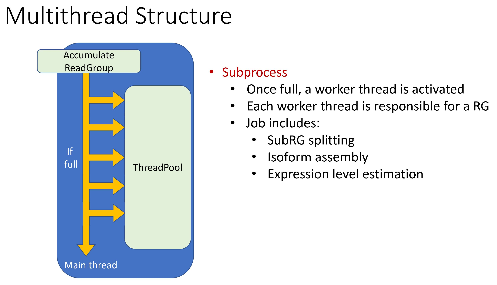

# IsoLasso_Parallel
[](https://app.travis-ci.com/eternalding/IsoLasso_Parallel)

## Introduction

IsoLasso_Parallel is a **personal reimplementation** of IsoLasso[1], a LASSO Regression Approach to RNA-Seq Based Transcriptome Assembly.  

Please open issues if any issues were encountered.  
All suggestions are welcome.

## Features
IsoLasso_Parallel includes the following new features:

* Written in modern c++ (requires c++20 for the support of the STL range library) 
* Multi-thread computation using the threadpool implemented by Barak Shoshany[2] 
* Custom designed E-M algorithm for transcipt 
* CMake configurations with CI support and unittests for easy and stable  
* Fixed minor issues from the original IsoLasso

## Installation
### 1. Requirements
* g++-10
* cmake version >= 3.14
### 2. Build
```
git clone git@github.com:eternalding/IsoLasso_Parallel.git
cd IsoLasso_Parallel 
mkdir build
cd build
```
IsoLasso_Parallel provides two modes:
* RELEASE mode (recommended)
  * Multi-threaded
  * Outputs assembled isoforms and corresponding estimated expression level (.gtf)
* DEBUG mode 
  * Single-threaded 
  * Writing detailed readgroup information to an extra file (RGStats.txt)
  * Time consumption for running each phase
  
Build IsoLasso_Parallel:
* RELEASE mode
    ```
    cmake -DCMAKE_BUILD_TYPE=RELEASE ../
    make
    ```
* DEBUG mode
    ```
    cmake -DCMAKE_BUILD_TYPE=DEBUG ../
    make
    ```

## Test the installation
The building process of IsoLasso_Parallel includes both the main program and the unittest.  
Once the process is finished, one can test the program with the built unittest: 
```
./unittest
```
The built program should pass all the unittests

## Usage
[Warning] BAM file is currently not supported.  
IsoLasso_Parallel requires a **SORTED** SAM file as input.  
To run IsoLasso_Parallel with the given **SORTED** SAM file:
```
./IsoLasso_Parallel -i <YOUR SORTED SAM FILE> -o <OUTPUT PREFIX>
```
Once the program is finished, a .gtf file OUTPUT_PREFIX_isoforms.gtf recording assembled isoforms and corresponding estimated expression levels will be generated.  
If DEBUG mode is chosen, detailed readgroup information will recorded in the OUTPUT_PREFIX_RGStats.txt  
(The running time might be much longer due to massive I/O)

## Parallel structure


## Tips for adjusting the performance of isoform assembly
Hyperparameters were defined in lib/utils/Commontype.hpp.  

In which, **MAX_EXON_SPAN** and **MIN_GAP_SPAN** affects the sizes of assembled isoforms.  
The larger MAX_EXON_SPAN and MIN_GAP_SPAN are, the larger assembled isoforms will be.  
With low coverage SAM file, larger MAX_EXON_SPAN and MIN_GAP_SPAN were suggested.

## Reference
1. Li W, Feng J, Jiang T. IsoLasso: a LASSO regression approach to RNA-Seq based transcriptome assembly. J Comput Biol. 2011;18(11):1693-1707. doi:10.1089/cmb.2011.0171
2. Barak Shoshany, "A C++17 Thread Pool for High-Performance Scientific Computing", doi:10.5281/zenodo.4742687, arXiv:2105.00613 (May 2021)


  
